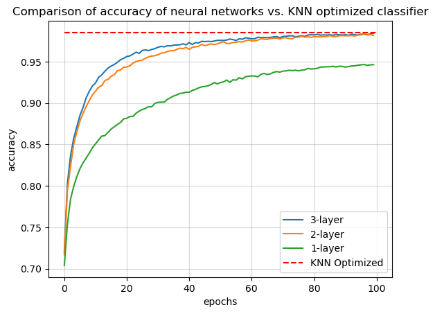
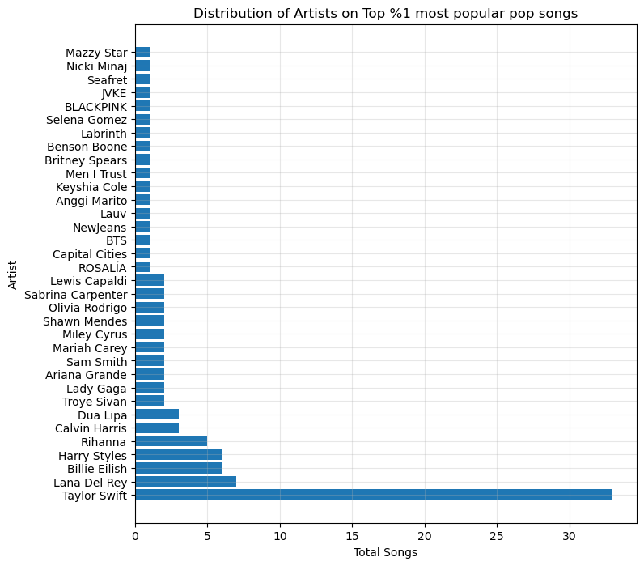
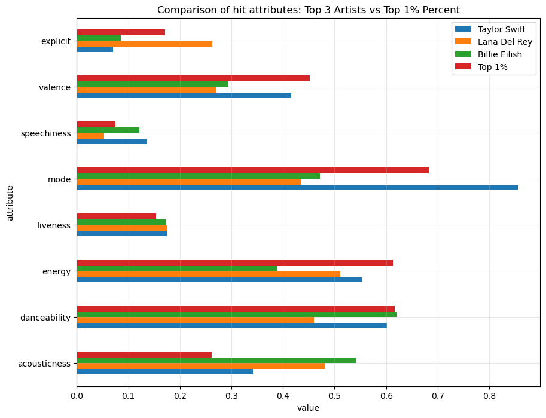
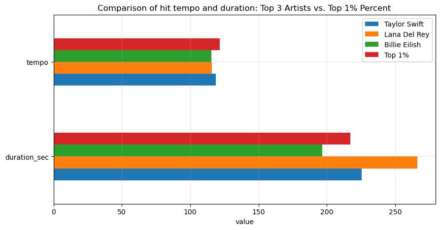
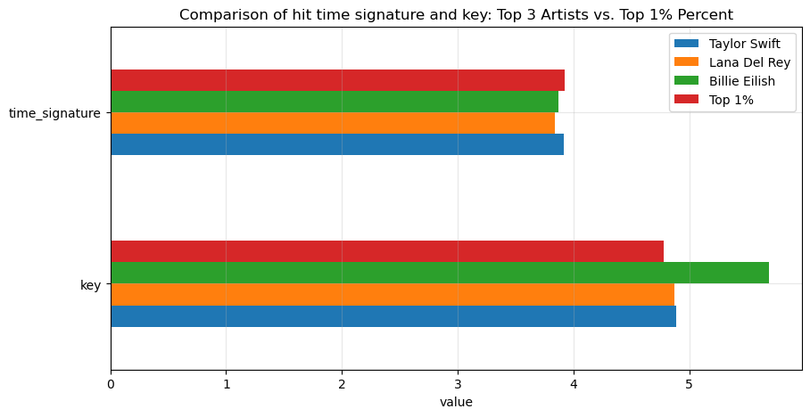

# Capstone Project: Let's make a hit song!

By [Marco Antonio Godoy](https://www.linkedin.com/in/marco-antonio-godoy)

## Executive summary
For more than 20 years, I've been actively and passively involved in the highly competitive music industry, in roles related to music production, engineering, composition, songwriting, performance and consulting. I've had the opportunity to work with many artists from different nationalities, styles and backgrounds, in a wide array of projects, from collaborations (aka "no money") to fully funded productions backed by major record labels. Over the years, I've witnessed how some of these artists have achieved international recognition, while others have not been able to grow their local niche audiences. Surprisingly, the financial support that major labels provide to their artists doesn't always translate into successful acts. In fact, by leveraging the power of social media, some independent artists have been able to grow bigger audiences than some of their counterparts, even with much smaller marketing budgets. Moreover, I've noticed how fans seem to favor the charisma and big persona of some artists over the exceptional talent of others. However, one crucial differentiator between those who "make it" in the music business and those who don't is that behind every successful artist there's always a "hit" (highly popular) song. Therefore, I find in this capstone project the perfect opportunity to leverage AI/ML techniques with the goal of identifying the  qualities and attributes that make a song a "hit".  

## Rationale
Some years ago, a friend of mine came to my studio asking for my help to record a song that he had just written. Although he was already a successful songwriter at the time, I admit that when I heard the song I didn't see any potential on it to become a hit. My friend, on the other hand, was convinced it was. I still helped him record the song, which in my opinion only had the quality of a songwriter demo (those which are pitched to artists). A few months later, I received a call from that same friend thanking me enthusiastically for helping him out with the record. The song and the recording we made that day had become a major hit!

That personal experience made me understand at a deep level the complexities of the music business, specially because of its subjective nature. Many record labels spend fortunes in the development of artists, but they often struggle to find songs that have the potential to become hits. This might be the reason why some artists have resorted into recording cover songs (songs that have been previously released by other artists). 

Therefore, designing a model that can predict with high accuracy if a song has the potential to become a hit can translate into significant cost reductions for both the artists and the record labels since it could help reduce the "guess" work when choosing which songs to record and promote.   

## Research Question
What are the attributes that a song needs to have to increase its potential for becoming a "hit"?

## Data Sources
This analysis is primarily based on a dataset titled [Spotify Dataset 2023](https://www.kaggle.com/datasets/tonygordonjr/spotify-dataset-2023) by Tony Gordon available at Kaggle. The author did an exceptional job fetching the data from the Spotify API and organizing it into five subdatasets containing "albums", "artists data", "Spotify data", "features data" and "tracks data". The total columns for the entire dataset is 108, and the largest dataset ("tracks data") contains a total of 438,938 entries, and a feature named "track_popularity" which will be a crucial feature in this analysis. Although this dataset seems to contain all the data needed to work on this analysis, additional data may be obtained from the [Spotify API](https://developer.spotify.com/).

<b>IMPORTANT: As stated by the dataset provider, the dataset was updated through December 20, 2023. Therefore, the track_popularity information is valid through that date.</b>

Another important data source is the [Billboard](https://www.billboard.com/) charts, which contains music listings rated by popularity and considered the industry standard for this purpose. For example: the [Billboard Hot 100](https://www.billboard.com/charts/hot-100/) lists the top 100 songs in the US, and the [Billboard Global 200](https://www.billboard.com/charts/billboard-global-200/) lists the 200 songs in the global market. 

## Methodology
The goal of this analysis was to use a scientific approach following the CRISP-DM framework for the implementation of machine learning and artificial intelligence techniques to determine the most important attributes that make a song a "hit". 

Using the high quality [Spotify Dataset 2023](https://www.kaggle.com/datasets/tonygordonjr/spotify-dataset-2023) provided by Tony Gordon (available at Kaggle), we were able to navigate through a vast amount of data and shape it to fit our business goals. The dataset contains a feature named "track_popularity", which is a score from 0 to 100 assigned by the Spotify platform to each track based on how popular it is among other tracks. This feature allowed us to identify the top 1% most popular tracks and use that as our threshold for determineing if a song is a hit or not. At this point, the problem became a data binary classification problemn. However, due to the highly imbalanced dataset that resulted from the labeling of the "hit" tracks, we relied on the SMOTE (Synthetic Minority Over-sampling Technique) technique to rebalance the data. Also, although we were not able to use the entire dataset due to computing resource limitations, we believe that the steps we took for the sampling of the dataset were supported by sound logical reasons that allowed us to preserve the quality of the analysis.  

Since we were dealing with a binary classification problem, we decided to train different classifiers such as Logistic Regression, K-Nearest, Support Vector Machines and Decision Trees. During the first iteration of the modeling process it was determined that the "pop" genre is the most influential factor that makes a song popular ("hit"). However, we decided to perform a second iteration (excluding genre) with the goal of finding out other influential factors. From this second iteration, it was determined that the "explicit", "speachiness", "danceability" and "energy" attributes were the most influential factors. However, on this second iteration, the performance of the models was significantly reduced when compared to the first iteration. Lastly, we performed a third iteration, but this time focusing on the pop genre (and its variants such as "art pop", "dance pop", etc.). From this iteration, we were able to determine that the most influential attributes that make a pop song a hit are "explicit", "liveness", "valence", "danceability", "duration" and "speechiness". This third iteration not only provided the most valuable insights, but also resulted in a KNN classification model with a ~98.5% accuracy after optimization. Even though we obtained a highly accurate model after the third modeling iteration, we also decided to explore other optimization opportunities through neural networks. However, even after optimization, these models were not able to perform as well as the KNN optimized classifier. 

As a final step in the analysis, we proceeded with the evaluation of our model. For this, we searched for the top 3 artists from top 1% most popular tracks on Spotify (as of December 20, 2023). The selected artists were Taylor Swift, Lana Del Rey and Billie Eillish, from which Taylor Swift had the most popular tracks (more than 30 hits). Next, we referenced the chart history for each of the artists on the [Billboard Hot 100 Charts](https://www.billboard.com/charts/hot-100/) to find out which songs had been on these charts at any point in time. Then, we proceeded with the making of predictions with our KNN optimized model. The model was able to make very accurate predictions for each of the artists, specially for Taylor Swift. However, we also determined that the high accuracy of the model makes it miss hit songs like "What Was I Made For?" by Billie Eillish, even though the song has a track popularity score of 94 in Spotify as well as having been on the Billboard charts for more than 34 weeks. 

Lastly, we provided what we believe to be powerful visualizations that contain the comparison of the attributes of the hits from each of these top 3 artists as well as the top 1% most popular tracks on Spotify. This allowed us to discover that these hits have many attributes in common, such as the "time signature", "tempo", "duration", "liveness", as well as differences that make these artists stand out from the crowd. However, even though from a scientific perspective it may seem like intentionally creating songs with these attributes should increase the possibility of these to become hits, unfortunately there are many other external factors, such as the marketability of an artist, financial support, music and social trends, and even political and economic conditions, that can influence if a song becomes a hit or not. Therefore, our goal is to continue to identify and explore these and other factors in the future, and gradually increase the scope of our model so that it eventually becomes a valuable tool that can assist the music industry in the process of developing and selecting high quality repertory. 

## Results
As mentioned above, this analysis followed the CRISP-DM methodology, and it resulted in three modeling iterations from which the following resutls were obtained:

### Modeling
#### Iteration #1:
<ul>
    <li>
        As per training time, aside from the Dummy Classifier (baseline model), KNN was the best performing model, followed by the logistic regression model.
    </li>
    <li>
        As per training accuracy, the best results were produced by the SVM classifier, followed by the Logistic Regresison classifier. Notice that the Decision tree model resulted in a perfect score for train accuracy, which is an indication of overfitting. 
    </li>    
    <li>
        As it relates to test accuracy, the best results were produced by the SVM classier, folllowed by the Logistic Regression classifier.  
    </li>
    <li>
        When it comes to precision, the best performing model was the SVM classifier, followed by the Decision Tree classifier. Notice that the KNN model obtained a perfect score in precision, which is an indication of overfitting.
    </li>
    <li>
        In regards to recall, both the SVM and Decision tree classifiers obtained the same top score. However, we suspect the DecisionTree is overfitted. 
    </li>
</ul>

#### Iteration #2:
Based on the discovery from the first modeling iteration, we wanted to explore what other features aside from genre, are common among hit songs. Therefore, on this second modeling iteration the "genre" feature was excluded: 
<ul>
    <li>As per training time, aside from the Dummy Classifier (baseline model), KNN was the best performing model, followed by the logistic regression model.</li>
    <li>As per training accuracy, the best results were produced by the KNN classifier, followed by the SVM classifier. Notice that the Decision tree model resulted in a perfect score for train accuracy, which is an indication of overfitting.</li>
    <li>As it relates to test accuracy, the best results were produced by the SVM classier, folllowed by the KNN classifier.</li>
    <li>When it comes to precision, the best performing model was the KNN classifier, followed by the Decision Tree classifier.</li>
</ul>

As an overall observation, all models obtained a lower score across all metrics when compared to the first iteration (where genre was included). 

#### Iteration #3:
For the third iteration, we followed the same approach as in iterations #1 are #2, except this time the focus was on the "pop" genre and its variants.
<ul>
    <li>
        As per training time, aside from the Dummy Classifier (baseline model), KNN was the best performing model, followed by the logistic regression model.
    </li>
    <li>
        As per training accuracy, the best results were produced by the KNN classifier, followed by the SVM classifier. Notice that the Decision tree model resulted in a perfect score for train accuracy, which is an indication of overfitting. 
    </li>    
    <li>
        As it relates to test accuracy, the best results were produced by the Decision Tree. However, as indicated aboove, this model seems to be overfited. Therefore, the models that produced the best results for test accuracy were the KNN classifier and the SVM classifier.  
    </li>
    <li>
        When it comes to precision, the best performing model was the KNN classifier, followed by the Decision Tree classifier (overfitted).
    </li>
    <li>
        In regards to recall, aside from the Dummy Classifier and the DecisionTree (overfitted), all models produced similar results.
    </li>
</ul>

As an overall comment, on this third iteration (only focused on the pop genre) the we can see a significant boost in performance across the KNN, Decision Tree and SVM classifiers.

### Optimization:
From the modeling process, it was determined that the KNN classifier was one of the top performing models. Therefore, using further optimization was done via GridSearch from which it was found that 11 was the the optimal value for <i>n_neighbors</i>. The model achived a ~0.985 accuracy score. Even though the optimization of the KNN classifier produced a highly performing model, we decided to explore optimization opportunities via neural networks. The results are shown in the following visualization:

As it can be observed, at 100 epochs none of the neural networks were able to match the ~0.985 accuracy score obtained from the KNN classifier after the optimization. Therefore, we can conclude the KNN is the best model to achive for the prediction of a hit song of the pop genre.

### Evaluation
After achiving a highly accurate prediction model, we proceded to evaluate it by making predictions with the repertory of the top most popular pop artists in Spotify. As it can be seen on the chart below, these artists are "Taylor Swift", "Lana Del Rey" and "Billie Eillish":

The results of the predictions are summarized below:

#### Taylor Swift
- The model was able to correctly predict most of the songs on the Billboard Charts, including "Cruel Summer", "Anti-Hero", and "Delicate", "Karma", "Style", "Is It Over Now?" among many others.
- The predictons were more accurate for the most recent songs, such as "Anti-Hero" and "Cruel Summer". This has to do with the fact that the model was trained based on the popularity score as of December 20, 2023. This means, songs that were hits in the past but were not within the top 1% of most popular songs in Spotify as of that date, were not considered "hits" by the classifier.

#### Lana Del Rey
- The model was able to correctly predict some of the songs on the list in the Billboard chart history, including "Say Yes To Heaven", "Youn and Beautiful", "West Coast", and "Doin' Time". 
- An important observation is that when compared to Taylor Swift, Lana Del Rey has significantly less hits.
- The predictions also included songs that were not released recently. For example, "Young and Beautiful" was released in 2013, but still have a popularity score of 88 on Spotify. This is great to see because the release date was intentionally left out of from the features when training the model. 

#### Billie Eillish
- As it can be observed on the predictions table, the model was able to correclty predict songs like "Bad Guy", "Therefore I Am", "Happier Than Ever", "Bury A Friend". 
- As it was the case with Lana Del Rey, when compared with Taylor Swift, Billie Eillish also have significantly less hits on the billboard charts. However, the top songs on Billie Eillish chart history were released within the last two years.

- One important observation is that the song "What Was I Made For?", which was released in July 2023 and it's on the second position on the chart history with 24 weeks on the charts, did not get predicted as a hit by our model. After comparing the atttributes of this song against the top 1%, we made the following discoveries:
    - The song "What Was I Made For", differs significantly to the top 1% most popular songs when it comes to acoustiness, energy, valence and mode. 
    - In practical terms, the fact that the song is mainly acoustic, low energy, with "non-happy" content, even though it is in a major mode, makes the model predict that it is not a hit. 
    - Surprisingly, the popularity score on Spotify for this track is 94 and it was on the Billboard Hot 100 chart  for more than 34 weeks, reaching position 14 at a peak in a august 23.    

### Overall Comparison
The following are the resuls of the comparison of the attributes of the hit songs by the top 3 artists we selected, against the top 1% most popular songs:

<b>Observations:</b>
- <b>Explicit</b>: we can see that whe it comes to explict content, these artists stay mostly in the "non-explicit" side, with Lana Del Rey being the artist with more explicit content (above average of the top 1%)
- <b>Valence</b>: we can see that Taylor Swift stays closer to the top 1% when it comes to valence (the positivity of the content in the song). However, In general, the audience seem to prefer contant that is below the 0.5 valence score. 
- <b>Mode</b>: We can see that Taylor Swift hits are mainly in the major mode, as opposed to Billie Eilish and Lana Del Rey. The top %1 also stays on the major mode side, with a score close to 0.7.
- <b>Liveness</b>: On this atttribute, all artists stay close to the top 1%. This attribute means that the songs are produced in a studio setting, as opposed to a "live" setting (i.e. live performance).
- <b>Energy</b>: As per energy, Taylor Swift and Lana Del Ray stay slight above the top %1 with their songs being slight above the neutral point (0.5). Billie Eillish stays on the less energetic side.
- <b>Danceability</b>: On this attribute, Billie Eillish is the closest to the top 1%, followed by Taylor Swift. Lana Del Rey stays below the neutral point. 
- <b>Acousticness</b>: the top 1% favors content that is close to 25% acoustic. Amonth the three artist, Billie Eilish is the one that stays further from the top 1%, while Taylor Swift stays around 35%.

 

<b>Observations:</b>
- <b>Tempo:</b> as it relates to the tempo of the track, all artists stay close to the top 1%, which is around 121 bpm.
- <b>Duration:</b> as per duration, Lana Del Ray stays above the average (longer songs), while Billie Eillish stays on the shorter song side. Taylor Swift stays close to the top 1%. 

 

<b>Observations:</b>
- "Time Signature": as it relates to time signature, all mainly favor the 4/4 time signature, which is also the common one for the top %1. 
- "Key": when it comes to key, both Lana Del Rey and Taylor Swift stay close to the key of "F", while Billie Eillish tends to get close to the key of F#. 

### Next steps
- As it was discovered during the analysis, the song genre seems to be a highly influential factor when determining the most important attributes for a song to become a hit. Therefore, as a next step, it seems reasonable to create subsets of data for each genre and use this data to train genre specific models. This may lead to the discovery of other genre attributes that are relevant for each genre. For example, "explicit" may not be an important feature in instrumental music.      
- Since the data classification of this analysis relied heavily on the track popularity feature for the labeling of the songs as "hit" or "not hit", this means the model most be trained with new data as it becomes available, Therefore, a next step may be to look for an integration with the Spotify API to allow for a seemless data updating process. 
- The Billboard Charts are probably the most trusted standard when it comes to song popularity (hit) data. Therefore, it may be benefitial to also look to integrate the cross validation process with the Billboard API, and look to use the chart history data as the source to label hit songs (instead of the Spotify track popularity feature).

## Outline of project

- [Main Notebook](https://github.com/marcoantoniogodoy/ucberkeley-mlai-capstone-project/blob/main/CapstoneProject_20.1.ipynb)

## Contact and Further Information
If you have any questions, comments or suggestions, please reach out via [LinkedIn](https://www.linkedin.com/in/marco-antonio-godoy)